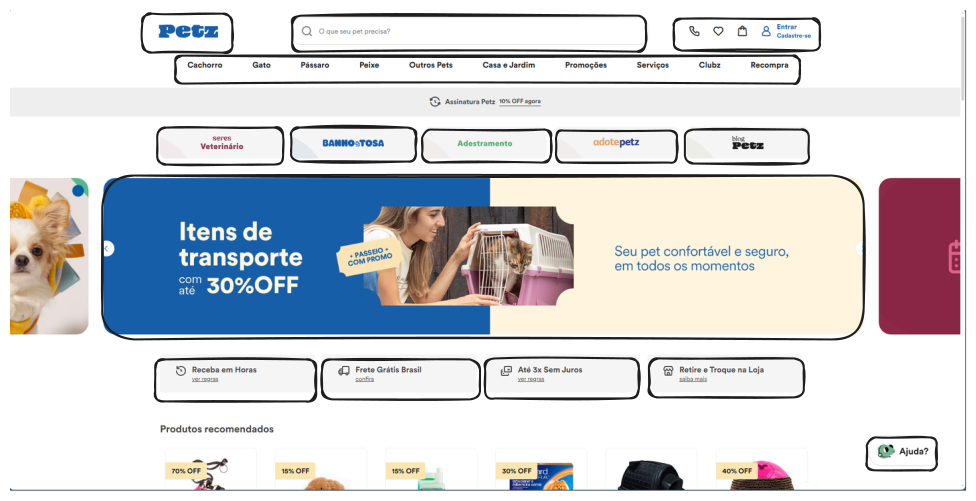

# Pet shop
sistema de pet shop feito nas aulas de programaçâo web no senac

# Conhecendo o negócio de um Pet shop 
Como exemplo vamos usar um sistema para um Pet shop.

**Conte-me sobre o negócio de sua empresa, seu objetivo e o mercado onde atua:**

o objetivo do meu Pet shop è fornecer produtos e serviços de qualidade para o cuidado de animais de estimaçâo,como raçôes,brinquedos,medicamentos,vacinas,banhos e tosas

**Que tipo de produtos ou serviços o Petshop oferece?**

Banho,hidrataçâo dos pelos,desembaraçamento,tosa na màquina ou tesoura,escovaçâo e clareamento de dentes,corte de unhas e limpeza de ouvidos e remelas.

**O que diferencia você de seus concorrentes ?**
- investir em transportes para buscar os pets em casa,levando para Banho e tosa,para consulta ao veterinario e entregando em segurança para seus donos.
- oferecer veìculos adaptados para especies de animais 
- ter um serviço de agendamento personalizado
- oferecer serviçôs adicionais,como buscar e entregar produtos do pet shop atè os seus clientes
**Descreva abaixo o público alvo do seu negócio:**
o publico alvo de um pet shop geralmente è composto por pessoas que tem animais de estimaçâo como câes,gatos,peixes,passaros,hamsters,coelhos,repteis entre outros.

**Se possível, informe o nome e o website de seus principais concorrentes.**
Comida para câes https://www.zeedog.com.br/kitchen
Comida para gatos https://www.petz.com.br/

**Qual o principal objetivo do seu website**
oferecer produtos e serviços de qualidades para os cuidados de animais de estimaçâo
como raçôes,brinquedos,vacinas,banhos e tosa.

**Liste até 2 websites que você considere interessantes, informando o que especificamente lhe agrada neles.**
https://www.animalepetshop.com.br/ 
https://www.zeedog.com.br/kitchen

